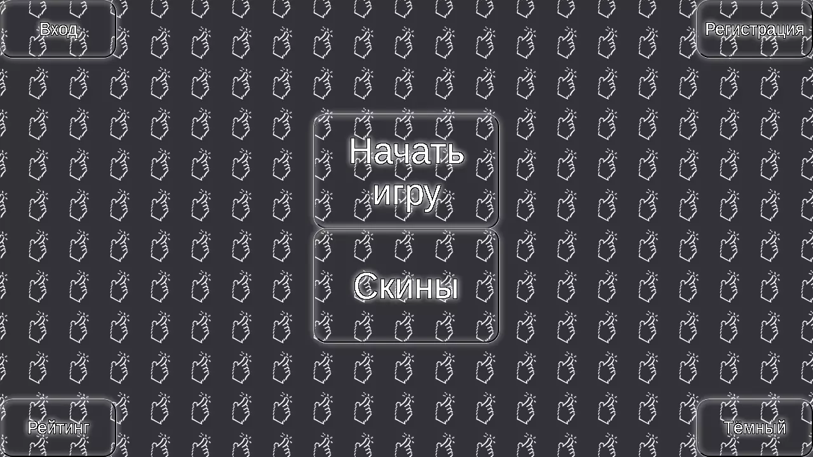
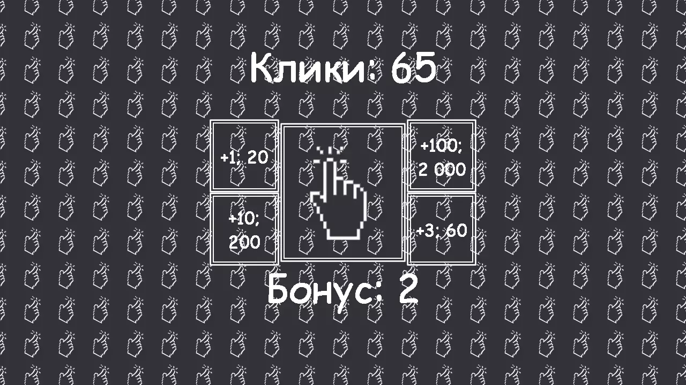
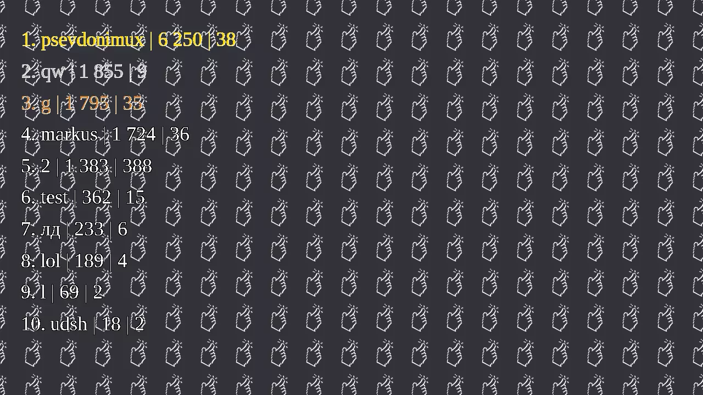
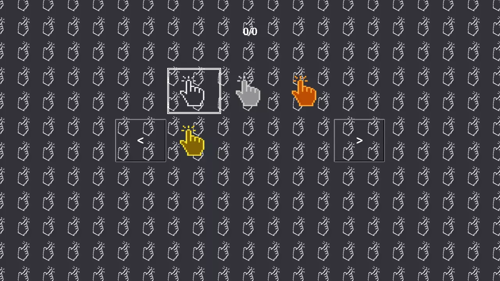
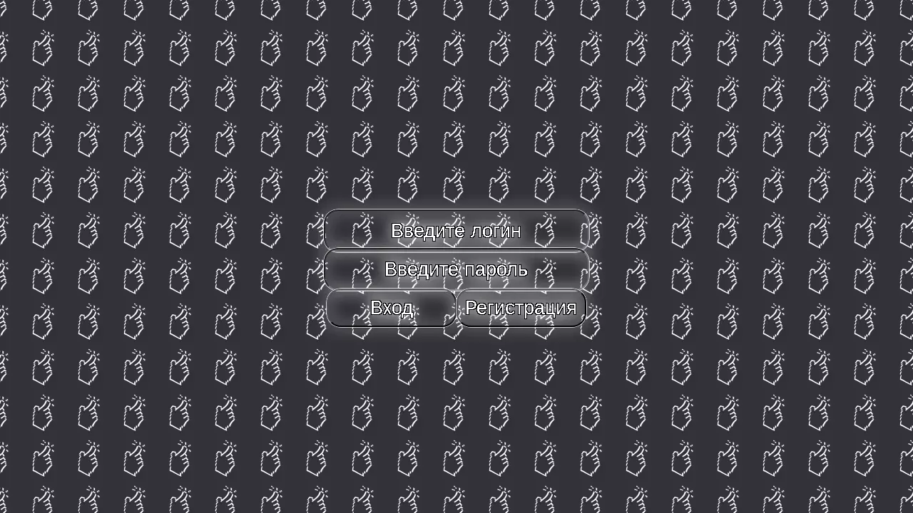

# LivDest of Clicks Battle

Click Battle - competitive game where players earn clicks and compete for a place in the ranking.

## Installation

```bash
curl -sL https://raw.githubusercontent.com/psevdonimux/livdest-of-clicks-battle/main/installer.sh | bash
```

## Configuration

1. Edit `.env`:
```
DB_HOST=localhost
DB_USER=root
DB_PASS=your_password
```

2. Start MariaDB:
```bash
mysqld_safe &
```

3. Create user (first run):
```bash
mysql -u root
ALTER USER 'root'@'localhost' IDENTIFIED BY 'your_password';
FLUSH PRIVILEGES;
exit
```

4. Start PHP server:
```bash
php -S localhost:8080
```

## Screenshots

| Menu |
|------|
|  |

| Game |
|------|
|  |

| Rating |
|--------|
|  |

| Skins |
|-------|
|  |

| Authorization |
|---------------|
|  |


## Requirements

- PHP 8.0+
- MariaDB 10.5+
