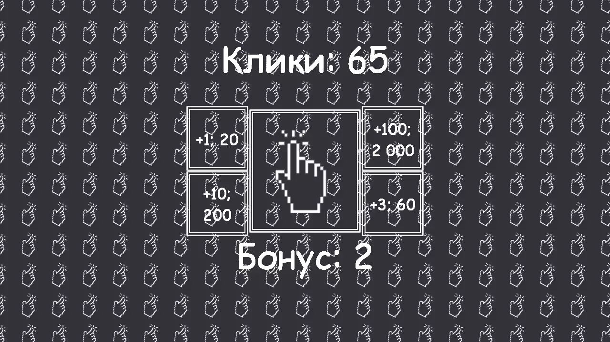
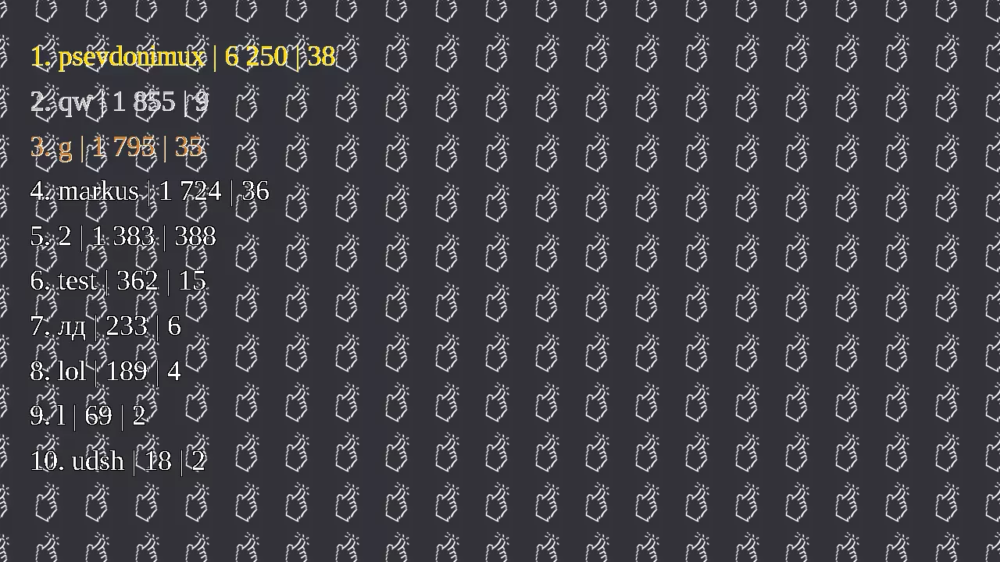
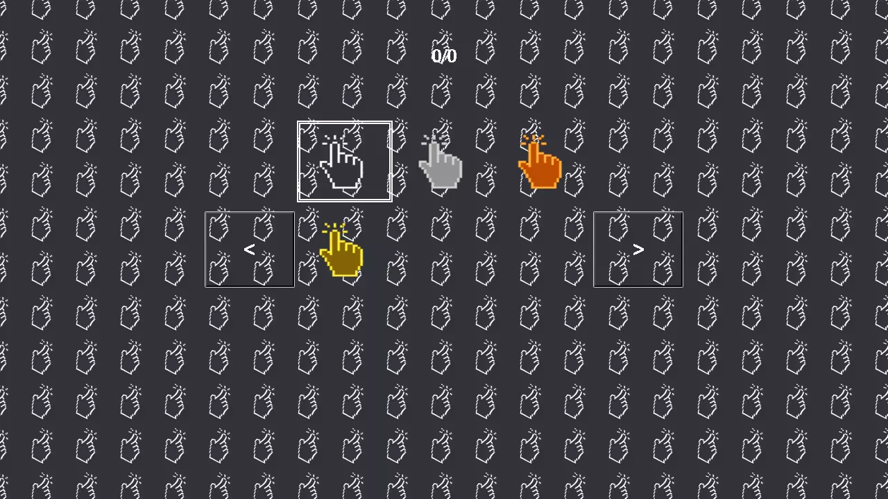
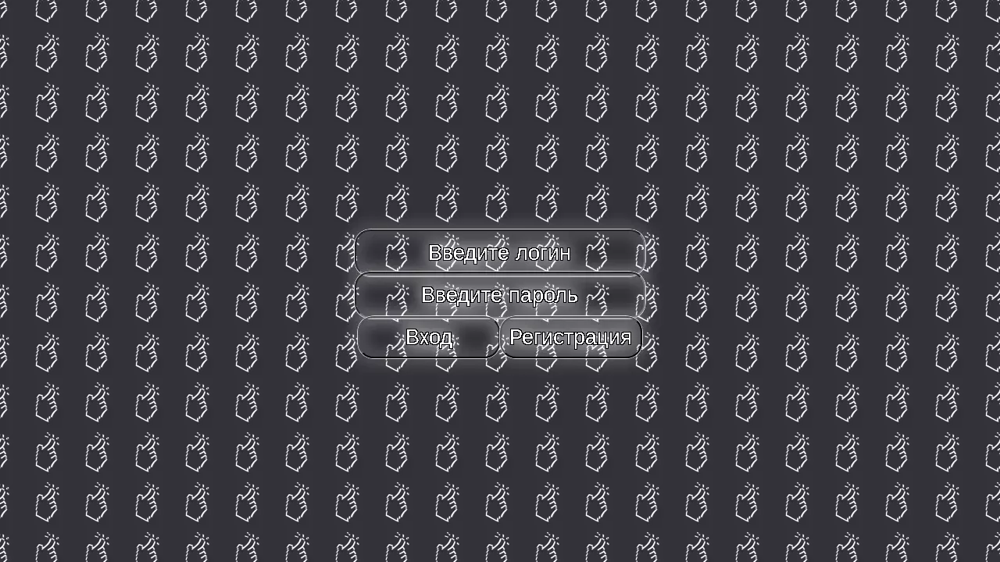

# LivDest of Clicks Battle

Битва кликов - соревновательная игра где игроки набирают клики и борются за место в рейтинге.

## Установка

```bash
curl -sL https://raw.githubusercontent.com/psevdonimux/livdest-of-clicks-battle/main/installer.sh | bash
```

## Настройка

1. Отредактируйте `.env`:
```
DB_HOST=localhost
DB_USER=root
DB_PASS=your_password
```

2. Запустите MariaDB:
```bash
mysqld_safe &
```

3. Создайте пользователя (первый запуск):
```bash
mysql -u root
ALTER USER 'root'@'localhost' IDENTIFIED BY 'your_password';
FLUSH PRIVILEGES;
exit
```

4. Запустите PHP сервер:
```bash
php -S localhost:8080
```

## Скриншоты

| Меню | Игра | Рейтинг |
|------|------|---------|
|  |  |  |

| Скины | Авторизация |
|-------|-------------|
|  |  |


## Требования

- PHP 8.0+
- MariaDB 10.5+
